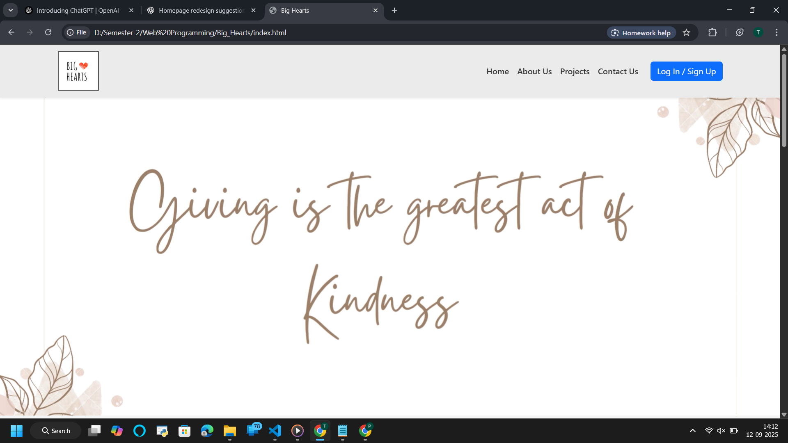
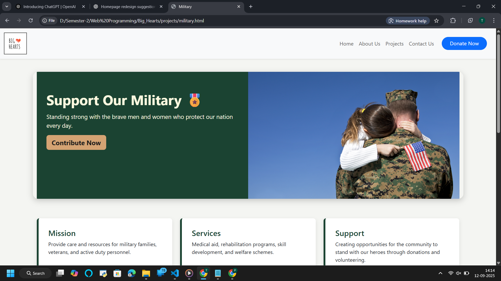
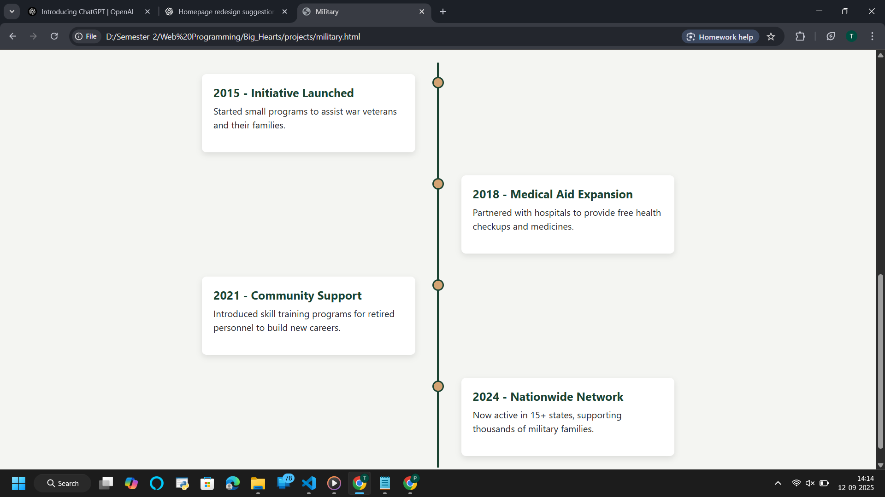
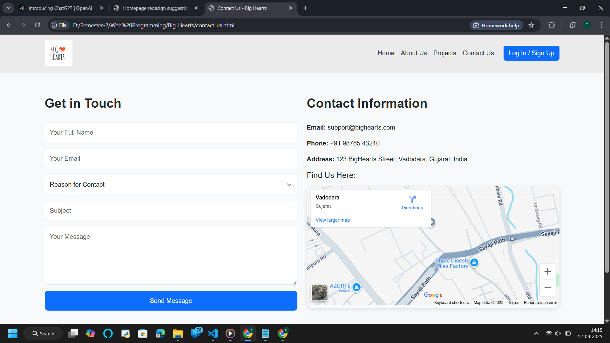
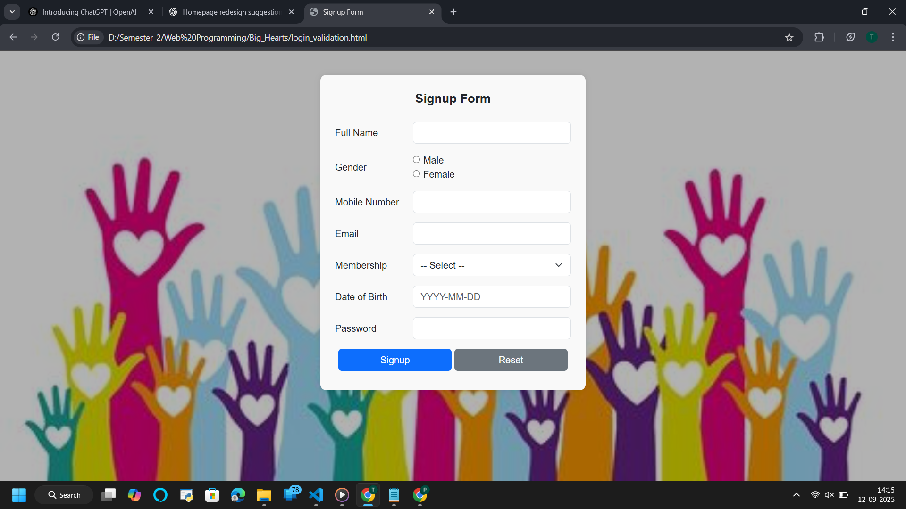
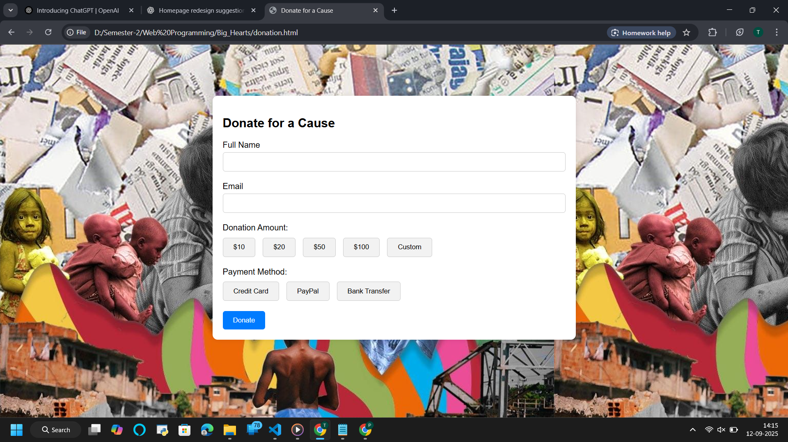

# Big Hearts – NGO Website 

## Overview
**Big Hearts** is a simple, elegant, and responsive NGO website designed to showcase social initiatives, projects, and opportunities for donations.  
It aims to spread awareness and encourage people to contribute towards causes such as **children, elderly, nature, pets, education, military families, oceans, and gardens**.  

The website provides easy navigation, dedicated project pages, and a fully functional **Contact Us** page with Google Maps integration.

---

## Features
- Responsive **Navbar** with Donate Button  
- **Home Page** introducing the NGO  
- **About Us Page** (Mission, Vision, Team Members)  
- **Projects Section** with multiple initiatives  
- **Children Page** showcasing child-focused efforts  
- **Contact Page** with form + map (Vadodara)  
- **Donation Page** (CTA for contributions)  
- Organized folder structure with image and video support  

---

## Technologies Used
- **HTML5**  
- **CSS3**  
- **Bootstrap 5** (CDN)  
- **JavaScript** (basic interactivity)  

---

## 📂 Folder Structure
```bash
├── index.html         # Main landing page
├── about_us.html      # About NGO and team
├── contact_us.html    # Contact form + Google Map
├── children.html      # Children initiatives
├── elderly.html       # Elderly care page
├── nature.html        # Environment projects
├── fairy.html         # Special causes
├── pets.html          # Animal welfare
├── military.html      # Military family support
├── ocean.html         # Marine life protection
├── education.html     # Education projects
├── garden.html        # Community gardens
│
├── css/               # Stylesheets (if any)
├── js/                # JavaScript files (if any)
├── image/             # All images (logo, banners, project visuals)
├── video/             # Videos (if included)
│
└── README.md          # Project documentation

## Future Enhancements
- Backend integration for storing Contact Form responses.
- Online Donation System (Razorpay, PayPal, Stripe).
- Admin Dashboard for managing projects and events.
- Dark/Light mode toggle for better accessibility.

## Contributors
- Tapasya Patel 
- Varun Patel

## Screenshots  

### Home Page  
  
  
  


### Projects - Military Initiative  
  
  

### Contact Us  
  

### Login / Signup  
  

### Donation  


